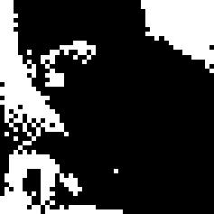

<div align="center">
  <p style="font-size: 2em; font-weight: bold; margin-bottom: 4; font-family: 'Courier New', monospace;">DitherCam</p>
 

</div>

# Dither-Cam: Real-time Camera Dithering for Raspberry Pi

This application extends the original Dither3000 desktop application with real-time camera functionality for Raspberry Pi. It allows you to apply dithering algorithms to both static images and live camera feed from a Raspberry Pi camera module.

## Features

*   All the features of the original Dither3000 app:
    * Open common image file formats (PNG, JPG, BMP, GIF, TIFF)
    * Apply Floyd-Steinberg (error diffusion) or Simple Threshold dithering
    * Adjust threshold, contrast, and pixel scale
    * Save the resulting dithered images
*   **New Camera Features:**
    * Connect to a Raspberry Pi camera module using the modern Picamera2 library
    * See real-time dithering effects applied to the camera feed
    * Capture still frames and apply dithering algorithms
    * Switch between camera mode and static image mode
    * Multi-threaded processing for smooth performance

## Hardware Requirements

* Raspberry Pi (tested on Raspberry Pi 4, but should work on Pi 3 and newer)
* Raspberry Pi Camera Module (v1, v2, or HQ Camera)
* Display for Raspberry Pi

## Software Dependencies

* Python 3.6+
* PyQt6 (for the GUI)
* Picamera2 (the new Raspberry Pi camera library)
* PIL/Pillow (for image processing)
* NumPy (for faster array processing)

## Setup for Raspberry Pi

1. **Set up your Raspberry Pi with Raspberry Pi OS:**
   * Install the latest Raspberry Pi OS (Bullseye or newer recommended for Picamera2)
   * Enable the camera module in `raspi-config`:
     ```
     sudo raspi-config
     ```
     Navigate to "Interface Options" > "Camera" and enable it

2. **Clone the repository:**
   ```bash
   git clone https://github.com/yourusername/dither-cam.git
   cd dither-cam
   ```

3. **Install dependencies:**
   
   Picamera2 is pre-installed on recent Raspberry Pi OS images (Bullseye and newer). If you need to install it manually:
   ```bash
   sudo apt update
   sudo apt install -y python3-picamera2
   ```

   Install other dependencies:
   ```bash
   pip install PyQt6 pillow numpy
   ```

4. **Run the application:**
   ```bash
   python main.py
   ```

## Usage

### For Static Images
1. Use the "Open Image" button to load an image
2. Adjust dithering parameters using the sliders
3. Click "Apply Dither" or enable "Auto-Render" for live updates
4. Save the dithered image using "Save Image"

### For Camera Feed
1. Click "Start Camera" to enable the camera feed
2. Adjust dithering parameters to see real-time effects
3. Click "Capture Frame" to take a still image
4. The captured image will be processed with the current dithering settings
5. Save the processed image using "Save Image"

## Implementation Details

The application uses a three-thread architecture:
1. **Main UI Thread**: Handles the user interface and user interactions
2. **Camera Capture Thread**: Continuously captures frames from the camera using Picamera2
3. **Frame Processing Thread**: Applies dithering algorithms to the captured frames

This multi-threaded design ensures smooth performance by separating the camera I/O, image processing, and UI rendering tasks.

## Note on Picamera2 vs. Legacy Picamera

This application uses the new Picamera2 library, which is the successor to the original picamera library. Picamera2 offers several advantages:

* Better performance and more options for camera control
* Support for newer Raspberry Pi models and camera modules
* Improved integration with the Raspberry Pi's camera stack
* Active development and maintenance

Picamera2 has a different API compared to the original picamera, so this code is not compatible with the legacy library.

## Building the Application

To create a standalone executable that can be run without installing Python or dependencies, you can use the included `build.py` script.

1. **Install PyInstaller:**
   ```bash
   pip install pyinstaller
   ```

2. **Run the build script:**
   ```bash
   python build.py
   ```

This script will create an executable in the `dist` folder.

## Acknowledgments

This project is based on the original [Dither3000](https://github.com/caaaan/basic-dither) application, extended with camera capabilities for Raspberry Pi.

## Motivation & Future Development

The original project began as a response to expensive dithering software. This extension adds real-time capabilities, making it possible to use with live camera feeds, opening up possibilities for artistic installations, vintage-style video processing, and more.

Future development may include:
* More dithering algorithms
* Video recording capabilities
* Hardware acceleration for better performance
* Web interface for remote control
* Ability to stream the processed video over a network

## Example Screenshot


## Building the Application

To create a standalone executable (.exe on Windows, .app on macOS) that can be run without installing Python or dependencies, you can use the included `build_app.py` script.

1.  **Prerequisites:**
    *   Install PyInstaller:
    ```bash
    pip install pyinstaller
    ```
    *   **Note:** This guide assumes you have Python installed on your system. If you don't have Python installed, please visit [python.org](https://python.org) to download and install the latest version for your operating system.
2.  **Run the build script:**
    ```bash
    python build.py
    ```
This script will automatically detect your operating system, clean previous builds, and run PyInstaller with the appropriate settings (including the correct icon file) to create the application bundle in the `dist` folder. You must run this script on the target OS (run on Windows to build for Windows, run on macOS to build for macOS).

## Setup

1.  **Clone the repository (or download the code):**
    ```bash
    # If using git
    git clone https://github.com/caaaan/basic-dither.git # Replace with your repo URL if applicable
    cd dither-app
    ```

2.  **Ensure you have Python 3 installed.** You can check with `python3 --version`.

3.  **Create and activate a virtual environment (recommended):**
    ```bash
    # macOS / Linux
    python3 -m venv .venv
    source .venv/bin/activate

    # Windows (cmd.exe)
    python -m venv .venv
    .venv\Scripts\activate.bat

    # Windows (PowerShell)
    python -m venv .venv
    .venv\Scripts\Activate.ps1
    ```

4.  **Install dependencies:** The main dependencies are Pillow (for image manipulation) and NumPy (for faster array processing).
    ```bash
    # Using pip (recommended within virtual environment)
    pip install Pillow numpy 

    # Or using Conda (if you prefer conda environments)
    # conda install pillow numpy
    ```
    
    **Note on Tkinter/Tk Support:**
    Tkinter is part of the Python standard library, but it requires the underlying Tcl/Tk libraries to be installed on your system. Most standard Python distributions (from python.org, macOS default, Windows, Conda) include this.


## Usage

Once the setup is complete and your virtual environment is active, run the main script:

```bash
python main.py
```

This will launch the application window.
1.  Use the "Open Image" button to load an image.
2.  Select the desired "Algorithm".
3.  Adjust the "Threshold", "Contrast", and "Pixel Scale" sliders.
4.  If "Auto-Render" is checked, the preview updates automatically. If unchecked, click "Apply Dither" to see the result.
5.  Use "Save Image" to export the output.

## Implementation Notes

*   **NumPy for Floyd-Steinberg:** The Floyd-Steinberg algorithm (`floyd_steinberg_numpy` function) is implemented using NumPy for significant speed improvements over standard PIL pixel iteration. It converts the image to a NumPy array, performs calculations directly on the array, and converts back.
*   **Contrast Adjustment:** The contrast slider uses `PIL.ImageEnhance.Contrast` to modify the image *before* it's passed to the selected dithering algorithm.
*   **Pixel Scale Implementation:**
    *   For *Simple Threshold*, a scale > 1 causes the algorithm to process the image in `scale x scale` blocks, calculating the average grayscale value for each block, thresholding that average, and filling the output block with the result.
    *   For *Floyd-Steinberg*, a scale > 1 uses a downscale-dither-upscale approach: the image is first downscaled by the scale factor (using `Image.Resampling.BOX` averaging), the standard dithering algorithm is applied to the small image, and the result is upscaled back to the original size (using `Image.Resampling.NEAREST` to preserve blocks).
*   **Image Resizing:** Image previews in the GUI are dynamically resized using PIL's `thumbnail` method to fit the allocated space in the labels. The actual dithering and saving operations are performed on the contrast-adjusted image data at the selected effective scale.


## Motivation & Future Thoughts

> I started this project after seeing someone sell a dithering software for 35$. Its very fucking slow btw I'm thinking of implementing it another way so that maybe I could use it with live images.
    pip install Pillow numpy     *(Note: Tkinter (ttk) is usually included with Python standard distributions. If you encounter `_tkinter` errors, especially on macOS, ensure your Python installation includes Tk support.)*    pip install Pillow numpy    
    **Note on Tkinter/Tk Support:**
    Tkinter is part of the Python standard library, but it requires the underlying Tcl/Tk libraries to be installed on your system. Most standard Python distributions (from python.org, macOS default, Windows, Conda) include this.

    However, if you are using a minimal installation or certain Linux distributions and encounter an error like `ModuleNotFoundError: No module named '_tkinter'`, you might need to install the Tk support libraries manually:

    *   **Debian/Ubuntu Linux:** 
        ```bash
        sudo apt-get update && sudo apt-get install python3-tk tk-dev
        ```
    *   **Fedora/CentOS/RHEL Linux:**
        ```bash
        sudo dnf install python3-tkinter tk-devel  # or yum install
        ```
    *   **macOS (Homebrew Python):** Homebrew usually installs `python-tk` automatically with Python. If you face issues, try reinstalling Python (`brew reinstall python@<your_version>`). The default macOS system Python typically includes Tk.
    *   **Windows:** Tkinter support is typically included with official Python installers.

    After installing these system libraries, you might need to recreate your virtual environment or reinstall Python itself in some cases.

## Performance Optimizations

The application includes several optimizations to minimize CPU usage and improve responsiveness:

### Memory Management
- Buffer reuse for frame capture and processing
- Only allocates new memory when frame sizes change 
- Uses `np.empty_like()` and `np.copyto()` instead of creating new arrays
- Pre-calculated block boundaries for pixel scaling operations

### Parallel Processing
- Uses Numba JIT compilation with parallelization for dithering algorithms
- Optimized vectorized operations where possible
- Parallel block processing for threshold operations

### Adaptive Performance
- Dynamic frame skipping based on CPU usage targeting 25% CPU
- Automatically adjusts frame rate based on processing capabilities
- Tracks performance metrics to adapt processing strategy

### Thread Management
- Integrated capture and processing in a single thread
- Direct processing of camera frames without intermediate conversions
- Careful thread synchronization with reusable buffers

### Resource Cleanup
- Robust camera resource management
- System-level cleanup to ensure resources are released
- Multiple safeguards for proper thread termination

## Building Standalone Application

To build a standalone executable:

```
python build.py
```

This will create an executable in the `dist` directory.

## License

See the LICENSE file for details.